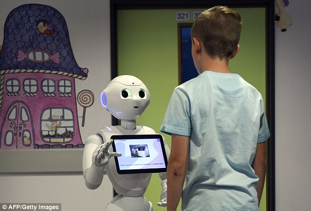
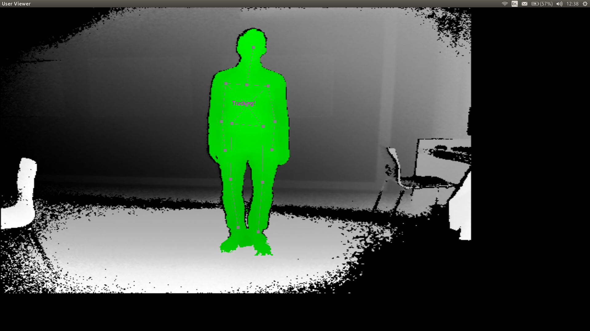
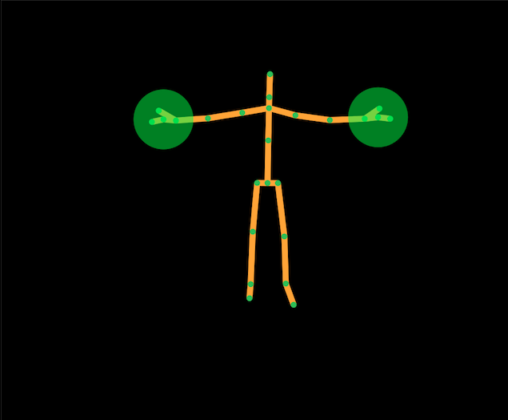
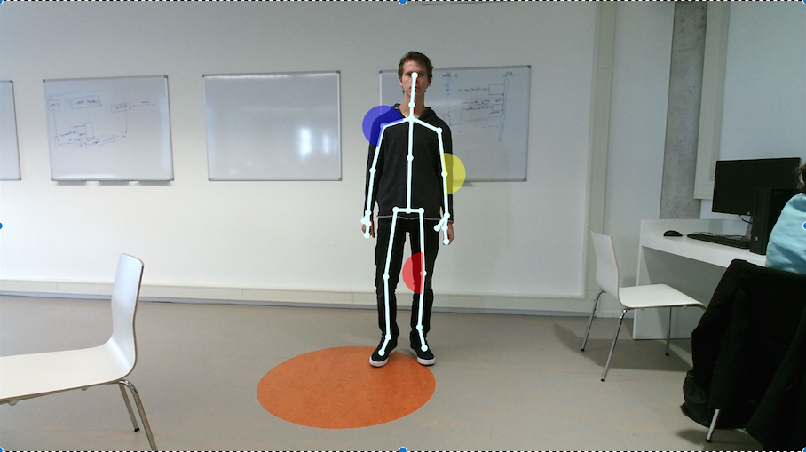
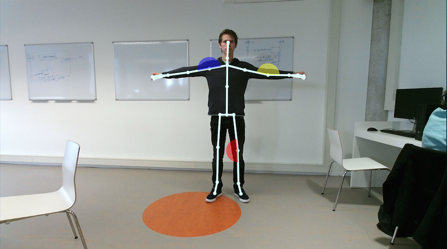
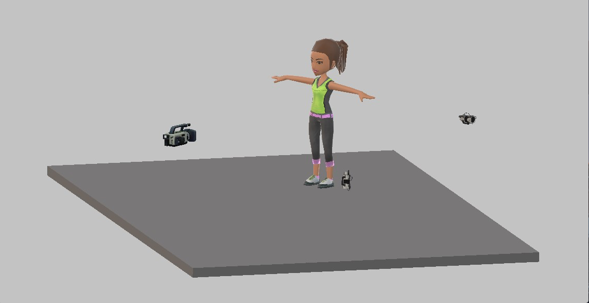
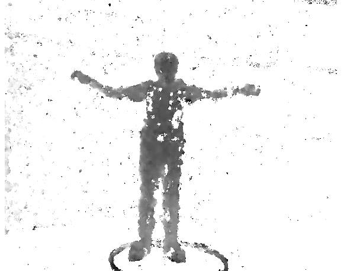

# Project Pepper

[{:style="float: right; width: 300px;"}](pepper.jpg)
Het LUMC en het lectoraat voor Health and Technology wil onderzocht hebben hoe een interactieve robot (Pepper) kan worden ingezet in het revalidatietraject van patiënten die een gewrichtsoperatie hebben ondergaan, bv een knie- of schouderoperatie. Deze patiënten moeten bijvoorbeeld elk uur specifieke oefeningen doen om snel te revalideren. In praktijk doen veel patiënten deze oefeningen vaak niet of niet correct waardoor de revalidatie minder goed verloopt. Dat is slecht voor de patiënt, de wachtlijsten en het ziekenhuis. Het idee is dat een robot langs de patiënt gaat om instructie te geven, te observeren of de oefening correct wordt uitgevoerd, eventueel bij te sturen, en verslag uit te brengen naar de arts hoe ver de patiënt in het revalidatietraject is. In deze eerste 20 weken is het doel om te herkennen of oefeningen correct worden uitgevoerd.

# Posts

## 10 november 2017

Naast het valideren van de Kinect hebben we de afgelopen weken geprobeerd de Kinect data weer te geven in grafieken. Hierbij hebben we wiskundige technieken gebruikt om ervoor te zorgen dat iedereen recht voor de camera wordt geroteerd voordat we bijvoorbeeld hoeken van een arm gingen berekenen. Bij het plotten van de grafieken kwamen we er ook achter dat we de oefeningen moeten scheiden als we ze overzichtelijk in een grafiek willen zetten. We hebben besloten om dit proces te automatiseren zodat nieuwe video’s ook opgedeeld kunnen worden per oefening. 

Afbeelding 15: Automatisch snijden van oefeningen (per arm).

Verder zijn we bij het LUMC in Rotterdam geweest, we kunnen hier helaas geen schouder patiënten opnemen. Als we dit willen doen moeten we eerst toestemming krijgen van de medisch ethische commissie, tegen de tijd dat dit goedgekeurd is zijn we 3 maanden verder. Voor ons onderzoek zijn wel patiënten nodig met een painful arc, we kunnen geen machine learning toepassen als we geen data hebben van de situatie die we zoeken. In de volgende periode gaan we opzoek naar een methode zodat we wel mensen kunnen opnemen met een painful arc.

---

## 27 oktober 2017

We zijn met de Kinect camera en twee digitale camera’s in het Atrium van de Haagse Hogeschool gaan staan om mensen op te nemen die alle drie de schouderoefeningen uitvoeren. Met de data die we hieruit verkrijgen, hopen we schouderpatiënten te kunnen detecteren. Aan de hand van de data kunnen we grafieken maken die ‘hopelijk’ afwijken wanneer iemand een pijnlijke schouder heeft.

 
Afbeelding 10: Eerste visualisatie.

In Python hebben we de eerste visualisatie gemaakt van de opnames van de drie – door de fysiotherapie van het LUMC voorgeschreven - oefeningen . Op afbeelding 10 is te zien dat de bewegingen zijn opgesplitst in een beweging van de rechter- en de linkerarm. Er valt te zien dat de symmetrie van de bewegingen redelijk overeenkomen.  Op Afbeelding 11 zijn de grafieken van afbeelding 10 samengevoegd tot één grafiek. 

[{:style="float: right; width: 300px;"}](Afbeelding%2011.png)
Afbeelding 11: samenvoeging van eerste visualisatie van vijf personen

[{:style="float: right; width: 300px;"}](Afbeelding%2012.png)
Afbeelding 12: Validatie

[{:style="float: right; width: 300px;"}](Afbeelding%2013.png)
Afbeelding 13: Protractor

Om te controleren of de gemeten gegevens van de KINECT valide zijn, zijn de hoeken handmatig gemeten. Hierbij hebben ze frames gepakt waarop ze handmatig de hoeken hebben berekend met een chrome tool, Protractor, waarmee je een cirkel kan tekenen op een afbeelding en hierbij een lijnt kan trekken vanaf het midden naar de zijkant. De schouder werd als middelpunt van de cirkel gezet en vervolgens werd er een groene lijn getekend die de hoek bepaald, zoals in afbeelding 13 te zien is. Er is gekozen om van elke vijf frames de graden van de persoon te meten. In de grafiek op afbeelding 12 zijn de hoeken die door de KINECT en handmatig gemeten zijn, naast elkaar gelegd. De KINECT hoeken zijn weergegeven met blauwe bolletjes, de handmatig gemeten hoeken zijn met rode kruizen aangeduid.

[{:style="float: right; width: 300px;"}](Afbeelding%2014.png)
Afbeelding 14: Bijgesneden grafieken

Om een goed beeld te krijgen hoe de personen de bewogen hebben, zijn de grafieken bijgesneden. Er is als het ware ingezoomd op de beelden waarbij men de daadwerkelijke oefening uitvoert. Dit is terug te zien op Afbeelding 14.

De drie bovenste grafieken zijn de originele grafieken, waarin de bewegingen tijdens de gehele opname te zien zijn. De drie onderste grafieken zijn de bijgesneden grafieken. Dit hebben we handmatig gescheiden aan de hand van de bijbehorende frames. In de toekomst hopen we dit anders aan te pakken, het kostte veel tijd om alles handmatig te scheiden.

---

## 6 oktober 2017

De afgelopen sprint zijn we weer volop bezig geweest met de KINECT. De programmeurs van ons team hebben een programma geschreven zodat we op een gestructureerde wijze beelden kunnen opslaan vanuit de KINECT.
Door in dit programma op ‘Start’ te klikken worden 2 files aangemaakt en een aparte map. Deze 2 files zijn een .xml file waarin alle skeleton joints ( gewrichten) worden opgeslagen, in de andere file wordt het opgenomen diepte beeld opgeslagen.

 
Afbeelding 9: KINECT programma voor het opslaan van data.

Hierop hebben we zelf een test opname gemaakt van een groepslid. De data uit deze testopname hebben we kunnen verwerken d.m.v. Microsoft Excel. Hieruit konden we voorlopig de volgende grafieken laten zien:

 
Vergelijking 1Hoek rechterschouder tegenover de tijd

Bij vergelijking 1 heeft de persoon alleen zijn rechter arm zijwaarts omhoog bewogen. Je kunt hier zien in welke hoek de schouder zich bewoog afgezet tegen de tijd. 

Uit deze grafiek kun je goed opmaken dat naar mate de tijd oploopt de hoek ook oploopt van pakweg 15 graden naar 120 graden. ( oranje lijn). De blauwe lijn die de linkerschouder aanduidt blijft gelijk. Dit klopt ook omdat deze arm niet bewogen is en dus langs het lichaam hangt.

 
Vergelijking 2Beide schouder tegenover de tijd

In vergelijk 2 heeft de persoon beide armen zijwaarts bewogen. Je kunt goed zijn dat allebei de armen de hoek vergroot worden tegenover de tijd. Je kunt hier echter zien dat de persoon asymmetrisch heeft bewogen. De rechterarm ( oranje lijn) stagneert in het midden waarna hij daarna weer oploopt. Hieruit kun je aflezen dat de persoon op een moment zijn arm slomer omhoog heeft bewogen.

Na dit inzicht zijn we , op donderdag 28 Oktober,  met de KINECT en 2 videocamera’s opnames gaan maken op de Haagse Hogeschool in het Atrium (zoals beschreven in de test setup van het vorige github bericht).
Er hebben in totaal van 61 personen , 3 verschillende schouder bewegingen opgenomen.  Dit heeft ons een hele berg ( echt héél veel ) data gegeven.
Deze data is omgezet naar .csv bestandsoort zodat dit ingeladen kan worden in Python. De komende weken gaan we ons richten op het bewerken van al deze data in python. Denk hierbij vooral aan het opschonen van de verkregen data.

---

## 22 september 2017 

Inmiddels zitten we alweer aan het einde van week 4 van ons onderzoek. De laatste twee weken zijn voorbijgevlogen, waarin er binnen de onderzoeksgroep en het onderzoek een aantal ontwikkelingen hebben plaatsgevonden. Sinds ons vorige bericht hebben wij twee enthousiaste Informatica studenten mogen verwelkomen in onze groep, waardoor wij nu met meer mankracht het onderzoek uitvoeren. Daarnaast is er een afspraak geweest met de opdrachtgever in het LUMC. Ook is besloten om voortaan de Kinect camera te gebruiken als ondersteuning bij het identificeren van schouderbewegingen van mensen. Een aantal ontwikkelingen zullen hieronder nader besproken worden. 

Uit het gesprek met de opdrachtgever is gebleken dat de doelstelling van het onderzoek gericht is op het vinden van een manier hoe manueel therapeuten van het LUMC gebruik kunnen maken van 3d-camera technieken (en eventueel bijbehorende software), om zo painful arcs* te identificeren. 

In ons vorige bericht lieten wij weten de Intel Real Sense camera - die vergelijkbaar is met de camera die in de Pepper robot zit - te willen gebruiken. Door nader onderzoek naar de output van de Intel Real Sense en de mogelijkheden van de Kinect camera, is gekozen om de laatstgenoemde camera te gebruiken. Uit het door ons uitgevoerde literatuuronderzoek is gebleken dat bij gebruik van deze camera effectiever en efficiënter resultaten gerealiseerd kunnen worden door een drietal voordelen:

1. Er is meer softwareondersteuning voor de Kinect camera waardoor wij hier minder tijd aan hoeven te besteden.
1. De Kinect SDK’s zijn verder ontwikkeld waardoor er meer functies al beschikbaar zijn. Waaronder een skeleton tracking algoritme.
1. Er is literatuuronderzoek beschikbaar over de nauwkeurigheid en betrouwbaarheid van de Kinect camera.

Inmiddels is de Microsoft Kinect aangeschaft en zijn hier een aantal libraries en SDK’s uitgeprobeerd. Deze zijn hieronder afgebeeld. 

[{:style="width: 300px;"}](Pepper122092017.png)
Afbeelding 1: Freenect, OpenNi2, NITE

[{:style="width: 300px;"}](Pepper222092017.png)
Afbeelding 2: Freenect, OpenNi2, NITE

[{:style="width: 300px;"}](Pepper322092017.png)
Afbeelding 3: Kinect SDK

[{:style="width: 300px;"}](Pepper422092017.png)
Afbeelding 4: Kinect SDK

[{:style="width: 300px;"}](Pepper522092017.png)
Afbeelding 5: Vitruvius 

[{:style="width: 300px;"}](Pepper622092017.png)
Afbeelding 6: Vitruvius 

[{:style="width: 300px;"}](Pepper722092017.png)
Afbeelding 7: Test Setup

In afbeelding 7 is de test setup voor het identificatieproces van de schouderbewegingen te zien. Wij willen dit realiseren aan de hand van een drietal camera’s: een front camera (Kinect), een camera voor het zijaanzicht en een camera die opnames maakt vanaf de grond. De camera’s voor zijaanzicht en onderaanzicht zijn alleen nodig om te valideren of de Kinect camera voldoende nauwkeurig is. Dit gaan wij handmatig meten. De metingen is voor ons de maatstaf voor de vergelijking. 
Wanneer de Kinect nauwkeurig genoeg is gebleken kunnen we afstappen van de twee extra camera’s en ons volledig richten op het automatisch meten d.m.v. de Kinect.

*Een painful arc is de hoek van een schouderbeweging (zie afbeelding 8) die door schouder patiënten - tijdens het uitvoeren van deze beweging - als pijnlijk beschouwen wordt. Deze hoek kan per patiënt verschillen. Hierdoor is het zaak om (nauwkeurig) te achterhalen waar deze hoek zich precies bevindt tijdens het bewegen van de schouder. 

 
Afbeelding 8: De schouderbewegingen om de painful arc te identificeren. 

---

## 8 sept 2017
We zijn nu twee weken met veel enthousiasme bezig! Ons team bestaat uit een docent en 7 studenten met verschillende achtergronden (Informatica, Bedrijfskunde, Bedrijfskundige Informatica, Toegepaste Wiskunde). Om voor onszelf tot een haalbare doelstelling te komen, focussen we ons op het schoudergewricht. We willen dus onderzoeken of een pepper robot de oefeningen kan monitoren die patiënten na een schouderoperatie moeten uitvoeren.

De pepper robot is voorzien van een diepte camera die gebruikt maakt van de Intel RealSense libraries. Uit de literatuur weten we ondertussen dat het met vergelijkbare hardware (Kinect) mogelijk is om voldoende naukeurige beelden op te nemen. De standaard software die de Kinect aan boord heeft lijkt op dit punt wel verder ontwikkeld dan de RealSense software. Dat is dus een punt van aandacht.
Aangezien deze literatuur gebruik maakt van skeleton functies, die van een persoon een draadmannetje maken, focust ons onderzoek ons op dit moment op twee punten:
1. Het zoeken naar openbaar beschikbare skeleton algoritmes.
1. Het opnemen van testbeelden en hier handmatig metingen aan proberen te doen.

We hebben ondertussen skeleton algoritmes gevonden, en zijn bezig die op onze eigen systemen te proberen te compileren. [Hier](https://forum.openframeworks.cc/t/openni-skeleton-tracking/5125/2) is een voorbeeld op internet van een van de gevonden algoritmes. Zover proberen wij dus ook te komen.

Wij hebben met een los aangeschafte Realsense camera (dus nog even zonder Pepper robot eromheen) beelden kunnen opnemen. We zien dat de resolutie van de beelden niet direct zo goed is dat we overtuigd zijn dat metingen betrouwbaar zullen zijn. We zijn dus aan het experimenteren met verschillende instellingen. 
Hier twee voorbeelden. Op het eerste voorbeeld een opname op 1 meter afstand.

[{:style="width: 300px;"}](1meter1frames.jpg)

Op het tweede voorbeeld was de afstand 3 meter, en zijn om een beter beeld te krijgen 10 frames samengenomen.

[{:style="width: 300px;"}](3meter10frames.jpg)
