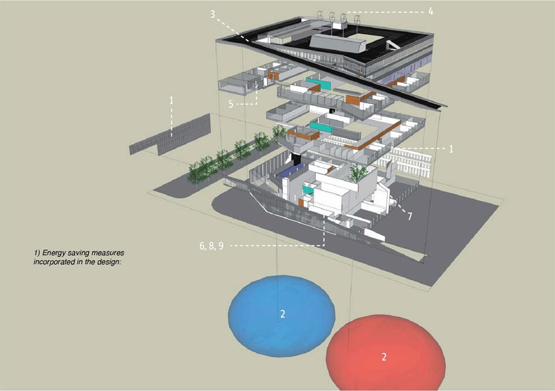

# Project Smart Building

[{:style="float: right; width: 300px;"}](smartbuilding.jpg)
Het gebouw van de Haagse Hogeschool op de TU Delft campus is duurzaam gebouwd en voorzien van 5000 sensoren die worden gebruikt om zo efficiënt mogelijk het klimaat in het gebouw te controleren. Soms werkt het systeem niet goed wat bijvoorbeeld kan leiden tot een te grote afwijking in temperatuur of lucht kwaliteit. Het doel van dit project is om onderzoek te doen naar de oorzaak van niet goed functioneren en het mogelijk voorkomen ervan door bijvoorbeeld het niet correct functioneren van sensoren te detecteren of voorspellen. Daarvoor wordt de sensordata gebruikt die over de afgelopen 10 jaar is verzameld.

