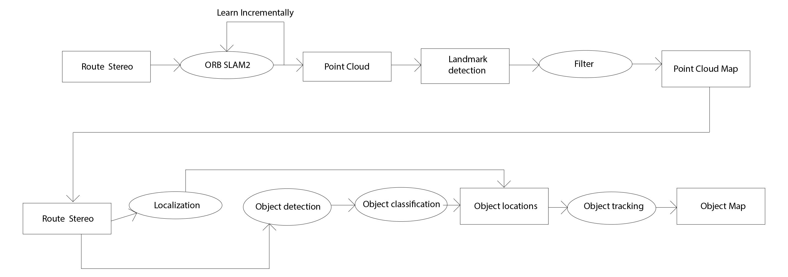
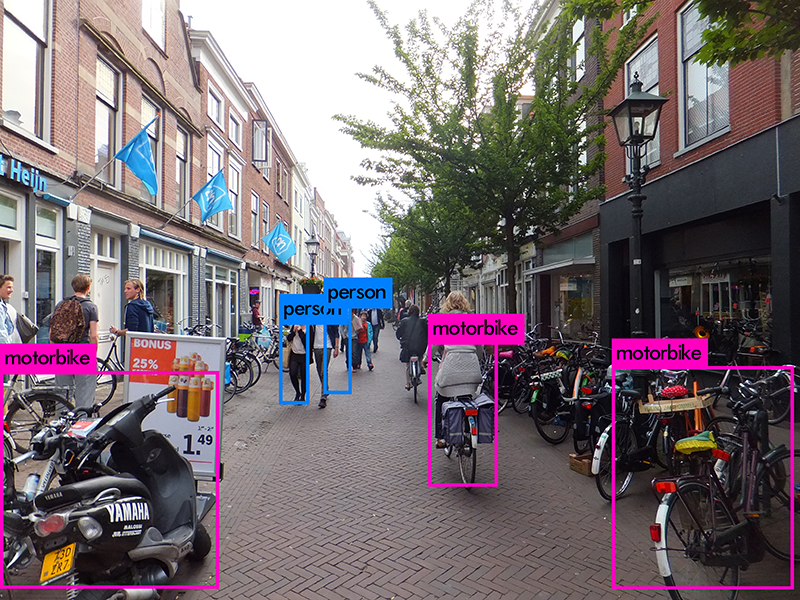
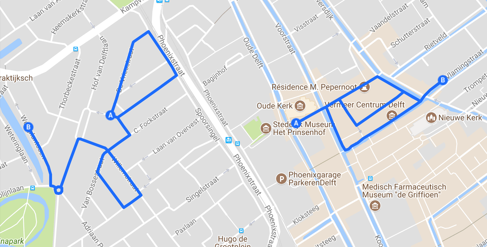

# Project Urbinn

[{:style="float: right; width: 300px;"}](urbinn.png)
Binnen het project Urbinn wordt een duurzame zelfrijdende stadsauto ontwikkeld door een samenwerkingsverband van o.a. de Betafactory, Accenda, het lectoraat Smart Sensor Systems, 6 faculteiten van de HHS, TU Delft en Accenda. De bijdrage aan Urbinn vanuit KB-74 is om camera beelden te gebruiken om de exacte positie en richting van de auto te bepalen en vaste en bewegende obstakels te classificeren zodat deze informatie in een vervolgtraject kan worden gebruikt om het autonoom rijden te onderzoeken.

Milestone 1 - Orientatie project
----------

In de eerste week hebben we ons georienteerd op de opdracht. Voor een inschatting van de locatie en het mappen van de omgeving worden Simultaneous Localization and Mapping (SLAM) algoritmes gebruikt. Die kunnen werken met verschillende sensoren zoals LIDAR, SONAR, aucoustisch en/of camera beelden. Omdat we in een volgende stap moeten herkennen wat het object is lijken camera beelden in ieder geval nodig. Bij het verkennen van SLAM-algoritmes blijken stereo camera beelden behoorlijk acurate resultaten op te leveren in real-time.

Er bestaan veel verschillende SLAM-algoritmes, die in veel gevallen het resultaat zijn van wetenschappelijk onderzoek. Op de site van de [KITTI Dataset](http://www.cvlibs.net/datasets/kitti/eval_odometry.php) staat een vergelijking van de verschillende algoritmes. We hebben een vooropige selectie gemaakt van de meest interessante algoritmes op basis van de resultaten, kwaliteit van de beschrijving, de beschikbaarheid van open source en de mate van ondersteuning. Voorlopig gaan we aan de slag met [SVO](https://www.google.nl/url?sa=t&rct=j&q=&esrc=s&source=web&cd=3&cad=rja&uact=8&ved=0ahUKEwjb_Z26m5PWAhXNZVAKHRQmBBAQFgg4MAI&url=http%3A%2F%2Frpg.ifi.uzh.ch%2Fdocs%2FICRA14_Forster.pdf&usg=AFQjCNH7yos-_jmOo3WUp8tUGLP-z9Jppw) en [ORB2](https://arxiv.org/abs/1610.06475).

Een voorbeeld van ORB2 SLAM op de KITTI Dataset (klik voor video) 

Milestone 2 - ORB localization gang Slinger/Kitti
----------

In week 3 zijn we begonnen met het maken van de eigen dataset gebasseerd op de gang (Slinger) van de Haagse Hogeschool. Onze milesstone voor sprint 2 is het mogelijk maken om middels onze eigen dataset of de KITTI dataset in te kunnen laden in het ORB-SLAM2 algoritme.
ORB-SLAM2 is inmiddels geinstalleerd op de server waarmee we de eerste testen hebben gedraaid. Daarnaast zijn er twee nieuwe groepsleden toegevoegd aan het Urbinn project die het totaal aantal leden op 10 brengt. We experimenteren met verschillende soorten camera's om te bepalen welke settings (fps, resolutie, etc) het beste en meest geschikt zijn voor dit project. 
Ook is het inmiddels mogelijk om de pointcloud van de map op te slaan waarmee het mogelijk moet worden om een semantische map van de omgeving te kunnen creëren. Tot slot is er gewerkt aan de juiste kalibratie van de camera's.   

Inmiddels is het week 4 en is einde van sprint 2 in zicht. De milestone van sprint 2 is voor het grootste deel behaald. Wij zijn in staat om de KITTI testdataset in te laden in het ORB-SLAM2 algoritme en een pointcloud te kunnen creëren aan de hand van de data. Tevens is het ons ook gelukt om de pointcloud op te slaan en opnieuw in te laden. Op dit moment zijn wij bezig om de afstanden in kaart te brengen tussen de keyframes en de orbs. Hierdoor is het mogelijk om diepte aan te geven van objecten in een bepaald frame. 
Verder hebben wij twee camera's gekalibreerd en zijn de eerste stereo videobeelden opgenomen van de gang (Slinger) van de Haagse Hogeschool. Dit is gedaan om deze dataset toe te passen met het ORB-SLAM2-algoritme.
Tot slot zijn de eerste voorbereidende stappen ondernomen voor milestone 3 (Milestone 3 - Object detection gang Slinger/Kitti). Wij hebben 2 intressante frameworks onderzocht betreffende real time object detection namelijk, [YOLO](https://github.com/pjreddie/darknet/wiki/YOLO:-Real-Time-Object-Detection) en [Fast R-CNN](https://github.com/rbgirshick/fast-rcnn).

Milestone 3 - Object detection gang Slinger/Kitti
----------	

Om milestone 3 te behalen zijn we begonnen met het onderzoeken van verschillende frameworks voor object detection en recognition. De belangrijkste eis is dat het framework in real-time objecten kan detecteren en herkennen. Om deze reden hebben we voor het framework YOLO, You Only Look Once, gekozen. YOLO kan met 45 fps uitgevoerd worden. Er bestaat ook een snellere variant, FAST YOLO, die met 155 fps uitgevoerd kan worden. 
Na het testen van YOLO gaan we beginnen aan de pipeline. De pipeline bestaat uit ORB SLAM2 om diepte te bepalen en YOLO om objecten te detecteren en herkennen, zoals te zien is in het overzicht hieronder.  

          

Inmiddels is er ook een begin gemaakt aan het evaluatieplan. We gaan plattegronden en met laser gegenereerde point clouds gebruiken om de nauwkeurigheid van de pipeline en camera setup te bepalen. Op basis hiervan kunnen we de pipeline verbeteren.

Inmiddels is het einde van de sprint voor het behalen van milestone 3 in zicht. Er is een evaluatieplan opgesteld om de accuraatheid van point clouds gegenereerd m.b.v. visual stereo SLAM-setups vast te stellen. Ook zijn varianten van het YOLO-framework getest, namelijk Tiny YOLO (FAST YOLO) en YOLO 9000. Tiny YOLO is een snellere variant van YOLO doordat het achterliggende neurale netwerkt kleiner is. YOLO 9000 is juist een uitbreiding van het orignele framework omdat het maarliefst 9000 classificaties gebruikt in plaats van 20. Tijdens het testen is gebleken dat Tiny YOLO goed genoeg is voor object detectie en herkenning. Het is wel noodzakelijk om meer classificaties toe te voegen aan Tiny YOLO, zoals in het Tiny YOLO plaatje hieronder te zien is.

          

Verder is de pipeline gewijzigd door voortschrijdend inzicht in YOLO. Hieronder is het vernieuwde overzicht te zien.

Milestone 4 - Volledige semantische map (testcase)
----------	

In milestone 4 is de focus gelegd op het uitwerken van het evaluatieplan uit milestone 3 om de testcase die we in deze milestone willen gaan opstellen te kunnen valideren. Dit betreft het uitwerken van het evaluatieplan om de output van YOLO en ORB_SLAM2 te evalueren. Voor het evalueren van YOLO is een script geschreven om de [intersection over union](https://www.pyimagesearch.com/2016/11/07/intersection-over-union-iou-for-object-detection/) en de false positives uit de output van YOLO te berekenen. 

Voor het evalueren van ORB-SLAM2 is besloten dat het programma CloudCompare gebruikt zal worden. Voor dit programma zijn twee resources nodig; namelijk de LiDAR ground-truth en de output van ORB-SLAM2. Het programma CloudCompare legt de LiDAR en ORB-Slam2 gegevens over elkaar en berekent hierbij het verschil door de “Nearest neighbour” methode. In de “Nearest neighbour” methode wordt gekeken naar punten van map A die het dichtst bij punten van map B zitten en uit deze afstand wordt de afwijking berekend.  

Het is van belang dat we de mogelijkheid hebben om ORB2 resultaten op te splitsen zodat we dit kunnen analyseren per keyframe. Hiervoor is een export van de beschikbare resultaten gerealiseerd die de informatie omzet naar XML formaat.

Voor het trainen van Tiny Yolo voor ons doel hebben we een afbakening gemaakt om relevante en belangrijke objecten te kunnen identificeren. Hiervoor is research uitgevoerd om te achterhalen of er al bestaande datasets bekend zijn. Door deze research hebben we de dataset COCO (common objects in context) gevonden. COCO is een grootschalig object detectie-, segmentatie- en classificatie dataset. Hierin staan meer dan 300.000 afbeeldingen van objecten waarvan meer dan 200.000 afbeeldingen gelabeld zijn. Deze afbeeldingen zullen gebruikt worden om Tiny Yolo te trainen en te evalueren.

Milestone 5 - Volledige Semantische Map Delft
----------------------

In week 9 van het project zijn taken uitgevoerd voor de volgende onderwerpen.
Trainen van Tiny Yolo
Dieptebeelden maken met ZED camera
ORB2 Slam incrementeel leren

Tiny Yolo is getraind op een server in Leiden. Op deze server is Darkflow (een variatie op Darknet) geïnstalleerd en deze is geconfigureerd als Tiny Yolo versie 2. Voor het trainen is gebruik gemaakt van de Kitty Dataset en zijn er 4 classes toegekend die herkend moeten worden. Aan het einde van het trainingssessie is er een recall van gemiddeld 50% van objectherkenning over elke afbeelding. Verder zal de Tiny Yolo v2 getraind worden met verder trainingsmateriaal dat bezit over 2.1 miljoen gelabelde afbeeldingen.

De ZED camera is operationeel gemaakt en hiermee zijn dieptebeelden gegenereerd. De dieptebeelden hebben nog geen specifiek doel in het project. Echter hebben we hier ideeën over die nog besproken zullen worden binnen de groep. Met de ZED camera zijn stereobeelden beschikbaar.

De eerste run in ORB2 Slam is uitgevoerd met de data van de ZED camerabeelden van de locatie “Slinger” in de Haagse Hogeschool. Deze beelden moeten eerst verwerkt worden om een resultaat te krijgen in de vorm van een pointcloud.

Week 11 zijn wij begonnen met het opdelen van het team in meerdere teams. Uit de testresultaten die gedaan zijn op ORB-SLAM2 bleek namelijk dat het ORB-SLAM framework bij een grotere hoeveelheid data memory leaks optraden. Om deze reden zijn er vier teams gevormd waarbij team 1 zich bezighoud met het dichten van de memory leaks. Een aantal "grote" memory leaks zijn inmiddels gedicht. Teams 2 is bezig met het herschrijven van ORB-SLAM2 in Python. Team 3 is druk bezig met het creëren van een eigen dataset door gebruik te maken van bestaande datasets en deze te wijzigen naar onze wensen. Tot slot is team 4 bezig met het evalueren en optimaliseren van YOLO, aangezien sommige bounding boxen door YOLO schuin op het object getekend worden. 

Helaas is de GPU voor onze server nog niet geleverd. Hierdoor zijn wij genoodzaakt om YOLO te trainen op de server in Leiden. Vanwege een aantal vertragingen in de planning zijn de deadlines van de milestones verschoven.

Inmiddels is het week 12. Wij hebben vernomen dat de GPU van de server volgende week (week 13) wordt geleverd. Deze zal ongeveer over twee weken operationeel zijn. Verder is URB uitgebreidt. URB's worden met elkaar vergeleken tussen het eerste frame en het eerst daaropvolgende frame. Tussen iedere frame zit 70 cm diepte verschil, wanneer bijvoorbeeld het eerste frame met het vijfde frame wordt vergeleken, is de afstand te groot om URB's met elkaar te kunnen matchen tussen de frames. 

Bovendien zijn wij bezig geweest met het uitbreiden van onze dataset. Hiervoor hebben wij een script gemaakt die de afbeeldingen en de labels kan spiegelen. Dit komt er praktisch op neer dat er een verdubbeling plaatsvindt van de gehele dataset. Verder gaan wij een test training doen met Yolo op onze eigen dataset. Dit om te kijken hoe goed Yolo hierop functioneert. Daarnaast zijn de opnames van de omgeving buiten de school door ORB meerdere malen (incrementeel) verwerkt. Dit is gedaan om de dichtheid van de pointcloud te kunnen vergelijken met de pointcloud van een eenmalige run door ORB. Tot slot zijn de  cameraposities van ORB worden gebruikt om de nauwkeurigheid van URB te bepalen.

In week 13 hebben we Urb verder uitgebreid.  De bindings van C++ naar python zijn gemaakt. Dit omdat we de C++ framework g2o gebruiken om de graph en bundle adjustment te maken. We hebben de door Urb gemaakte puntent nagemeten.  Objecten die dichtbij zijn hebben een kleine foutmargin tussen de 1 en 2 cm. Hoe verder het object is hoe groter de foutmargin wordt.
Om Urb nog te verbeteren waren we ook bezig  de voordelen van HSV  (Hue, Saturation, Value)  te onderzoeken. Bij grayscale kunnen nog meer punten fout gematcht worden. Er is ook een begin gemaakt aan de trajectory visualisaite van de Urb.

We waren klaar met het labelen van onze dataset. We hebben in totaal 2180 afbeeldingen gelabeld. De GPU is helaas nog niet geleveerd dus we hebben alle runs van Yolo op de server in Leiden uitgvoerd. 180 van de afbeeldingen werden voor de evaluatie gebruikt.
Er is ook een plan van aanpak gemaakt van hoe we beelden gaan opnemen in Delft. De route die we gaan volgen wordt hieronder afgebeeld.

